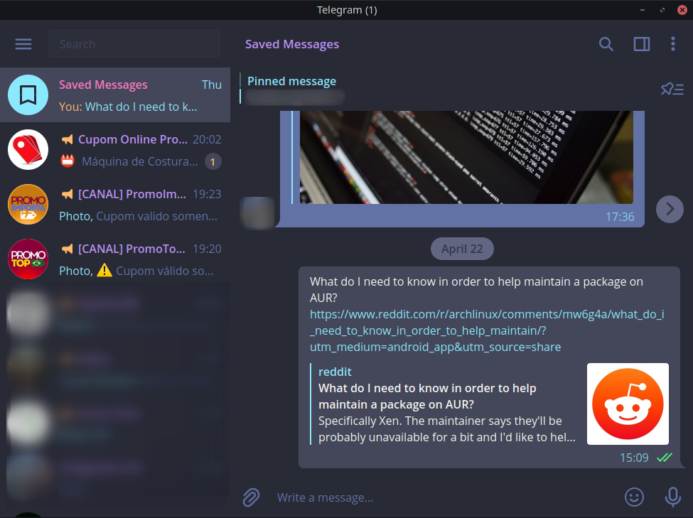

# Alternative Dracula theme for [Telegram Desktop](https://desktop.telegram.org/)

> An alternative dark theme for [Telegram Desktop](https://desktop.telegram.org/) inspired in [Dracula Telegram](https://github.com/dracula/telegram).

## Install

#### Using Git

You can install the theme and keep up to date by cloning the repo:

    $ git clone https://github.com/glaucomachado/telegram-dracula-theme.git

#### Activating theme

1.  In Telegram Desktop, go to Settings, `Chat Settings` and under the `Chat background` section click on `Choose from file`.
2.  Select the `colors.tdesktop-theme` file from the repo you just cloned.
3.  Click `Keep Changes` to apply the theme

## License

[MIT License](./LICENSE)
